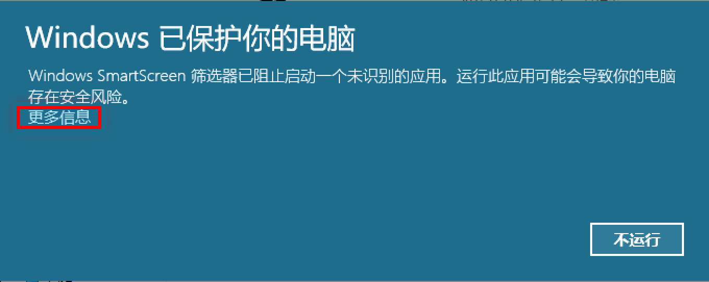
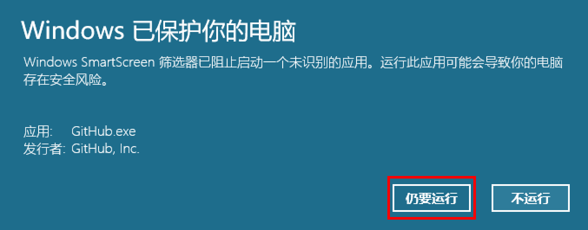
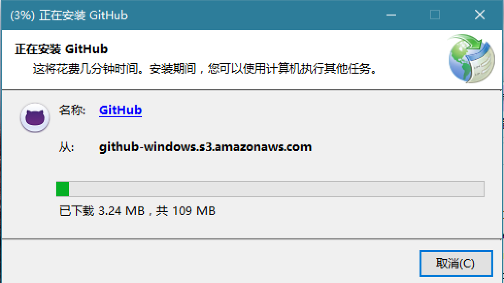
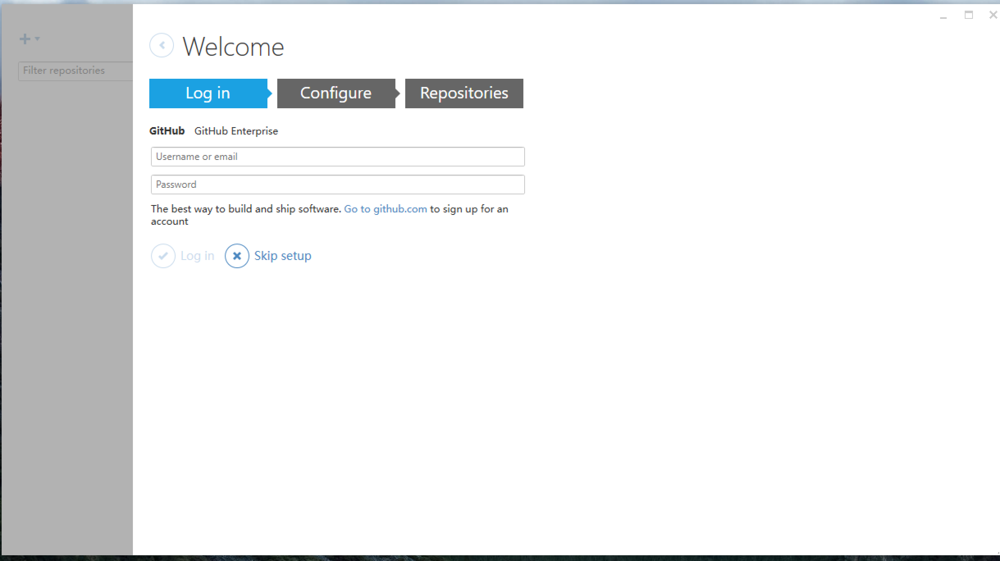
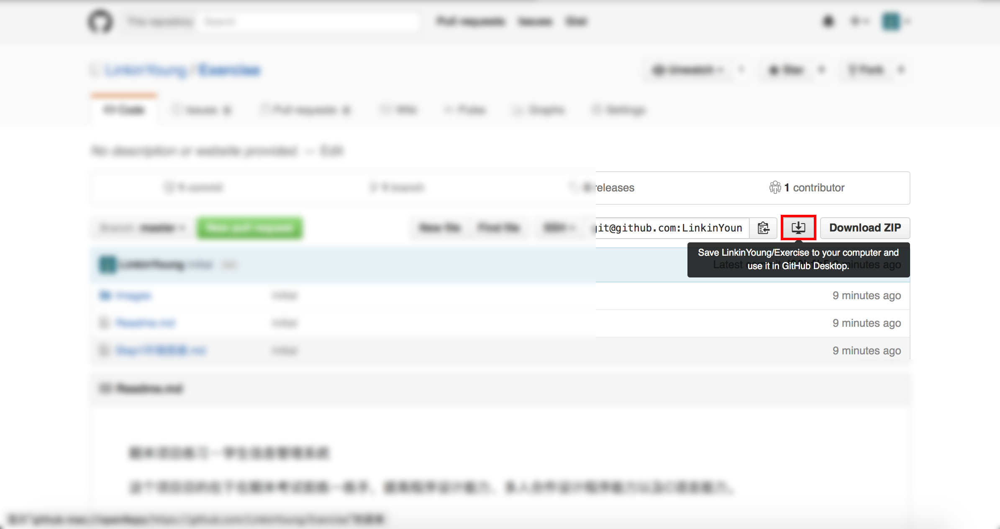
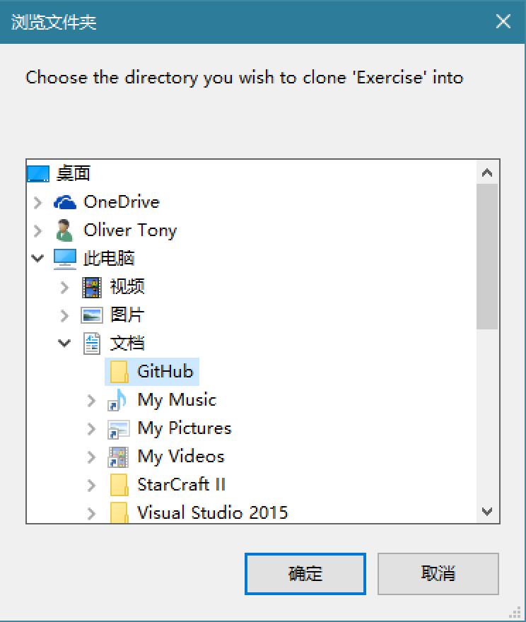

1. 登录[GitHub](https://github.com/ "GitHub · Where software is built")，注册一个帐号。

2. 下载客户端[GitHub Desktop](https://github-windows.s3.amazonaws.com/GitHubSetup.exe "GitHub Desktop")

3. 安装（可能会验证错误。。。在smartscreen界面点“详细信息”后点击“仍要运行”就可以了。然而这貌似不是Github的锅）

4.访问[仓库网页](https://github.com/LinkinYoung/Exercise "")，克隆到本地：

然后选择保存位置：

保存位置任意。